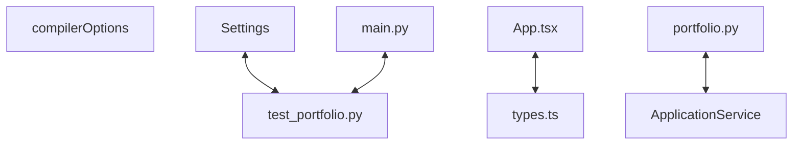

# Codebase Architectural Report

> **Auto-generated** by graphify knowledge graph analysis  
> **Purpose**: Dependency map, connection analysis, subsystem breakdown, and quality hotspots.

---

## 1. Executive Summary

- **Total Components**: `194`
- **Total Connections**: `363`
- **Subsystem Modules**: `1`
- **Dependency Types**: `11`

**Key Architectural Hubs:**

| # | Component | File | Type | Connections |
|---|-----------|------|------|-------------|
| 1 | `compilerOptions` | `frontend/tsconfig.json` | function | 18 |
| 2 | `main.py` | `backend/app/main.py` | file | 15 |
| 3 | `ApplicationService` | `backend/app/portfolio/service.py` | class | 14 |
| 4 | `test_portfolio.py` | `backend/tests/test_portfolio.py` | file | 13 |
| 5 | `App.tsx` | `frontend/src/App.tsx` | class | 13 |
| 6 | `portfolio.py` | `backend/app/api/portfolio.py` | file | 12 |
| 7 | `Settings` | `backend/app/core/config.py` | class | 12 |
| 8 | `types.ts` | `frontend/src/types.ts` | file | 12 |

---

## 2. Dependency & Connection Analysis

### Relationship Types

| Relationship | Count | Share |
|-------------|-------|-------|
| `contains` | 95 | 26% |
| `references` | 71 | 20% |
| `imports` | 60 | 17% |
| `rationale_for` | 59 | 16% |
| `calls` | 27 | 7% |
| `method` | 13 | 4% |
| `imports_from` | 12 | 3% |
| `inherits` | 9 | 2% |
| `uses` | 8 | 2% |
| `extends` | 6 | 2% |
| `conceptually_related_to` | 3 | 1% |

### Hub Dependency Diagram

### Most Connected Pairs

| Component A | Component B | Shared Connections |
|-------------|-------------|-------------------|
| `.__init__()` | `AuditService` | 2 |
| `.__init__()` | `AsyncDatabase` | 2 |
| `.__init__()` | `ApplicationRepository` | 2 |
| `create_application()` | `portfolio.py` | 1 |
| `get_application_service()` | `portfolio.py` | 1 |
| `list_applications()` | `portfolio.py` | 1 |
| `get_database()` | `portfolio.py` | 1 |
| `AuditService` | `portfolio.py` | 1 |
| `ApplicationRepository` | `portfolio.py` | 1 |
| `ApplicationCreate` | `portfolio.py` | 1 |

---

## 3. Subsystem & Module Breakdown

### 3.1 backend/app
**Nodes**: `194`  
**Files**: `backend/app/api/portfolio.py`, `backend/app/core/config.py`, `backend/app/core/database.py`, `backend/app/main.py`, `backend/app/platform/audit.py`, `backend/app/platform/context.py` +21 more

| Component | Type | File | Connections |
|-----------|------|------|-------------|
| `compilerOptions` | function | `frontend/tsconfig.json` | 18 |
| `main.py` | file | `backend/app/main.py` | 15 |
| `ApplicationService` | class | `backend/app/portfolio/service.py` | 14 |
| `test_portfolio.py` | file | `backend/tests/test_portfolio.py` | 13 |
| `App.tsx` | class | `frontend/src/App.tsx` | 13 |
| `portfolio.py` | file | `backend/app/api/portfolio.py` | 12 |
| `Settings` | class | `backend/app/core/config.py` | 12 |
| `types.ts` | file | `frontend/src/types.ts` | 12 |
| `list_applications()` | method | `backend/app/api/portfolio.py` | 10 |
| `get_settings()` | method | `backend/app/core/config.py` | 10 |

**External dependencies:** `Expose governed portfolio HTTP routes.` (1), `Build the service around the lifespan-owned Mongo database. Args: database:…` (1), `Persist an active, version-one application. Args: command: Validated…` (1), `Return a bounded newest-first governed application page. Args: context:…` (1), `Load runtime configuration for the EQIP API.` (1)

---

## 4. API Reference

Public classes and functions by subsystem.

### backend/app

| Name | Type | File | Connections |
|------|------|------|-------------|
| `compilerOptions` | function | `frontend/tsconfig.json` | 18 |
| `ApplicationService` | class | `backend/app/portfolio/service.py` | 14 |
| `App.tsx` | class | `frontend/src/App.tsx` | 13 |
| `Settings` | class | `backend/app/core/config.py` | 12 |
| `AuditService` | class | `backend/app/platform/audit.py` | 10 |
| `RequestContext` | class | `backend/app/platform/context.py` | 10 |
| `DomainValidationError` | class | `backend/app/platform/errors.py` | 10 |
| `ApplicationRepository` | class | `backend/app/portfolio/repository.py` | 10 |

---

## 5. Code Quality & Architectural Risk Hotspots

### Component Type Distribution

| Type | Count | Share |
|------|-------|-------|
| function | 70 | 36% |
| class | 66 | 34% |
| method | 39 | 20% |
| file | 19 | 10% |

### High-Connectivity Hotspots

**1** component(s) with >15 connections:

| Component | File | Connections |
|-----------|------|-------------|
| `compilerOptions` | `frontend/tsconfig.json` | 18 |

### Dependency Cycles

**122** circular dependency loop(s) detected:

| # | Cycle Path |
|---|-----------|
| 1 | `frontend_src_api_client → frontend_src_types → frontend_src_types_problemdetails` |
| 2 | `frontend_src_components_applicationform → frontend_src_types_tier → frontend_src_types` |
| 3 | `frontend_src_components_applicationform → frontend_src_components_applicationform_formstate → frontend_src_types_tier` |
| 4 | `frontend_src_types_criticality → frontend_src_components_applicationform_formstate → frontend_src_types_tier → frontend_src_types` |
| 5 | `frontend_src_types_health → frontend_src_components_applicationform_formstate → frontend_src_types_tier → frontend_src_types` |
| 6 | `frontend_src_components_applicationform → frontend_src_types_health → frontend_src_types` |
| 7 | `frontend_src_components_applicationform → frontend_src_types_criticality → frontend_src_types` |
| 8 | `frontend_src_api_client → frontend_src_types_applicationrecord → frontend_src_types` |
| 9 | `frontend_src_app → frontend_src_types_applicationrecord → frontend_src_types` |
| 10 | `frontend_src_components_applicationtable → frontend_src_types_applicationrecord → frontend_src_types` |

### Orphaned Components

**7** isolated node(s) with no connections:

| Component | File |
|-----------|------|
| `portfolio.spec.ts` | `frontend/e2e/portfolio.spec.ts` |
| `playwright.config.ts` | `frontend/playwright.config.ts` |
| `vite-env.d.ts` | `frontend/src/vite-env.d.ts` |
| `vite.config.ts` | `frontend/vite.config.ts` |
| `Governed Portfolio Todo` | `todos.yaml` |
| `Readiness Workflow Todo` | `todos.yaml` |
| `EQIP Portfolio Workspace` | `frontend/index.html` |

---

## 6. How to Navigate

1. **Interactive D3 Map** — open `graph.html` to explore node connections visually.
2. **Knowledge Graph Queries** — use MCP tools (`graph_query`, `graph_explain_node`, `graph_impact_radius`).
